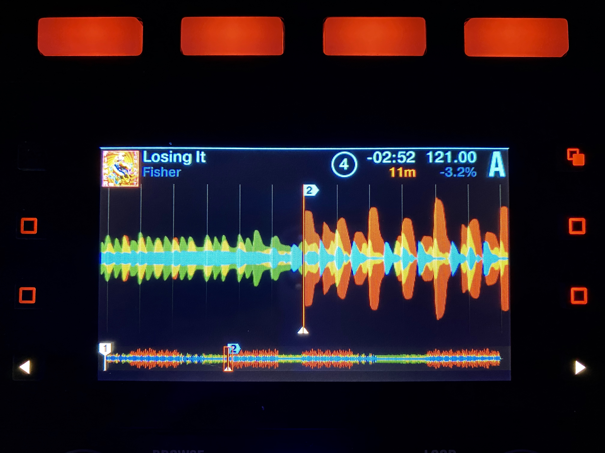
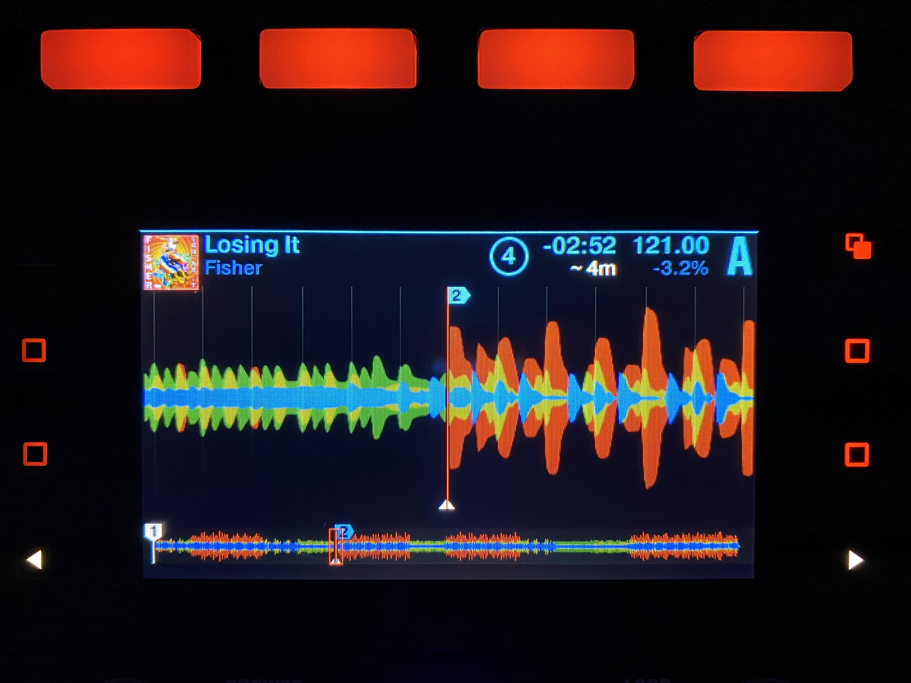

# Traktor S5 Mod

This is my attempt to fix all the shortcomings of this near-perfect DJ controller.

Please reach out to me with any bugs or feature requests.

## Compatibility

Traktor Pro:
- 2.11.0
- 3.2.19

NOTE: Traktor Pro 2 is no longer supported and may not contain all features listed below.

## Modifications

### Display

- Spectrum colors to distinguish highs, mids, and lows
- Deck header shows
  - color-coded Camelot key (when key is LOCKED)
  - approximate Camelot key (when key is UNLOCKED)
- Browser SortBy reduced to three variables: artist, bpm, and key
- Removed overlay hide delays

### Controller

#### Transport

- Right Knob to adjust loop size
- PUSH Right Knob to loop
- Left Knob to seek (by loop size) or move the loop

#### Browser

- PUSH Left Knob to open the browser
- Loading:
  - Left Knob to browse
  - PUSH Left Knob to load the selected track
- Preview:
  - PUSH Right Knob to start playing selected track in preview mode
  - Right Knob to seek through preview track
- Sorting:
  - SHIFT + Right Knob to change sorting type
  - SHIFT + PUSH Right Knob to invert sorting
- Preparation [1]:
  - Top Right □ to toggle selected track in and out of your preparation playlist
  - Bottom Right □ to jump to preparation playlist

[1] Preparation requires you to manually select a preparation playlist by right clicking on a playlist in the Traktor software.

#### Beatgrid Edit

- From any track screen:
  - SHIFT + Top Left □ to toggle beat grid edit mode
  - SHIFT + Top Right □ to set load marker at cursor
  - SHIFT + Bottom Right □ to reset the load marker
- From edit mode:
  - Top Left □ to lock edit mode
  - Bottom Left □ to enable tick [2]
  - Top Right □ to tap the beat [3]
  - Bottom Right □ to reset BPM
  - Arrows [<] or [>] to halve or double the BPM
  - PUSH Left Knob to zoom in on a single beat
  - Back (<) to switch between seek and edit mode
  - When in edit mode (back button blinking):
    - Left Knob to adjust offset
    - Right Knob to adjust BPM
  - When in seek mode (back button not blinking):
    - Left Knob to seek through track

[2] Tick plays an audible sound on every beat. This feature requires headphones routed from the monitor channel and for the track to be CUEd.

[3] Tap allows you to fix the beat grid alignment by tapping four consecutive beats while the song is playing.

#### Mixer FX [4]

- SHIFT + FILTER_ON to open the Mixer FX menu for that deck
  - Left Knob to browse effects
  - PUSH Left Knob to set current effect on all decks
- SHIFT + FX Arrows [<] or [>] to cycle though Mixer FX for that deck

[4] Mixer FX allow you to change the behavior of a deck's filter knob. There are currently five effects: filter, reverb, dual delay, noise, and time gater.

#### Misc

- Back (<) to reset deck Mixer FX (Filter)
- HOLD Back (<) to reset deck key and tempo
- Global and deck tempo knobs perform coarse adjustment when SHIFT is not held
- SHIFT + FLUX for flux reverse

## Credit

As far as I'm aware, all inputs and ouputs for these configuration scripts are completely undocumented. That means that this process requires tedious guess and checking with no guarantee of success. There are some features I simply would not have figured out on my own and it's important to give credit where credit is due.

Here is a list of pioneers and their corresponding features that I have adapted:

- Traktor Supreme Edition MOD [Go support Aleix on Patreon](https://www.patreon.com/supremeedition)!
  - MixerFX

## Installation

**Windows:**

1. Download or clone the repository.
2. Depending on your Traktor Pro version, copy the corresponding qml folder to:
   `C:\Program Files\Native Instruments\Traktor 2\Resources64`
   or
   `C:\Program Files\Native Instruments\Traktor Pro 3\Resources64`
   and replace all files.

**Mac:**

1. Download or clone the repository.
2. Depending on your Traktor Pro version, navigate to:
   `Applications/Native Instruments/Traktor 2`
   or
   `Applications/Native Instruments/Traktor Pro 3`.
3. Right click on Traktor and select `Show Package Contents`.
4. Copy the qml folder to `Contents/Resources` and select merge. (Note: Merge preserves newer items. Make sure to download this mod AFTER installing or updating Traktor.)

## Screenshots

